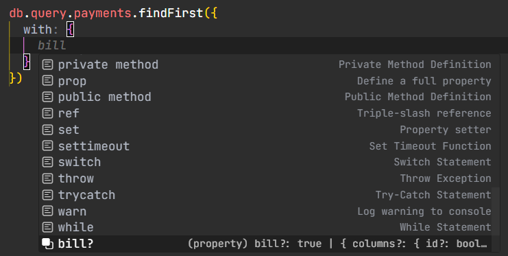
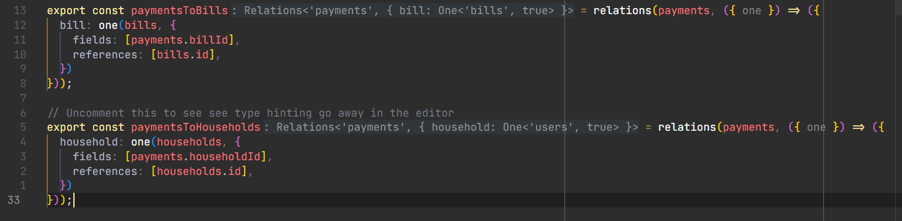
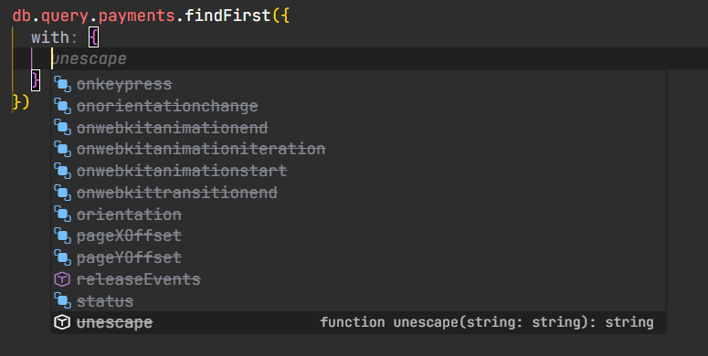
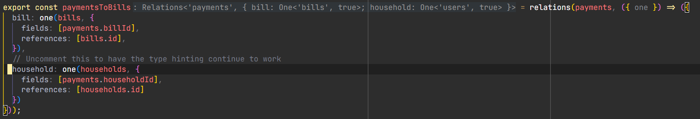
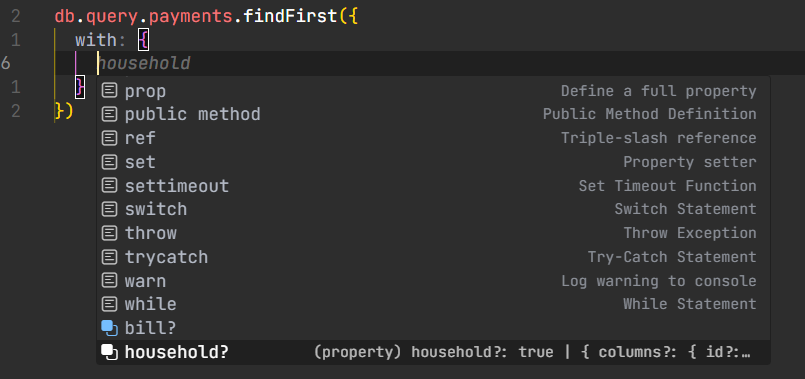

# Purpose

The purpose of this repo is to share with the Drizzle ORM team an issue that I am when using 
Drizzle ORM, specifically the query builder, when having multiple `relations` calls on the same table.

## Screenshots

### Before adding in a second `relations` call on `payments` table

### After uncommenting lines 32-38 in `payments` table

### Combining both calls into one

## Description of issue

When using the `relations` helper to map tables to one another for use with the `db.query.[table-name]` helpers, I lose type hinting inside the `with` option whenever a table appears in multiple `relations` calls, as evidenced by the example `payments.table.ts` file, which is a simplified version from a project of mine.